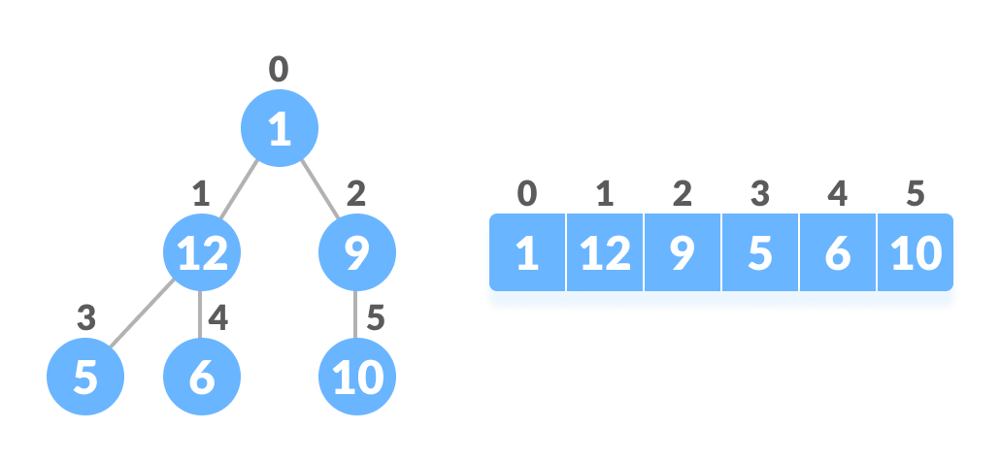

# Heap Sort

Heap sort works by visualizing the elements of the array as a special kind of [complete binary tree](#references) called a [heap](#references). This algorithm works by creating a max-heap data structure from the unsorted list, and exchanging the root (largest element) of the max-heap with the last element in the list. This process of creating the max-heap and swapping the elements at the root and last element of the unsorted-list, repeats until all the elements are sorted.

When a complete binary tree is represented in an array, the positions of parents and children of any subtree follow a specific property. If the index of any element in the array is `i`, the element in the index `2i+1` will become the left child and element in `2i+2` index will become the right child. Also, the parent of any element at index `i` is given by the lower bound of `(i-1)/2`.



A binary tree is said to be a `max-heap` if it is a complete binary tree and all nodes in the tree follow the property that they are greater than their children. For a `min-heap`, all nodes in the tree are smaller than their children.


## Working of Heap Sort

- Heapify:
  To maintain the max-heap property in a tree where both subtrees are max-heaps, we need to run heapify on the root element repeatedly until it is larger than its children, or it becomes a leaf node.
  1. Find the indices of the children for the given root element at position `i` using the formulae `2 * i + 1` for left child and `2 * i + 2` for right child.
  2. Find the largest element between the root and the children nodes.
  3. If the root is not the largest element in that subtree, swap the positions of the largest element and root element.
  4. Apply the heapify function on the new-position of the previously root element

```
heapify(arr, n, root_i):
    left_child <- (2*root_i) + 1
    right_child <- (2*root_i) + 2
    
    largest <- position of the largest element between the root and children
    (positions of children should not be larger than n)
    
    if root is not the largest element:
        swap(arr[root_i], arr[largest])
        heapify(arr, largest)
```

- Heap Sort:
    1. Starting from a complete binary tree, modify it to become a Max-Heap by running a function `heapify` on all the non-leaf elements of the heap.\
       Since the list representation follows the index property mentioned above, the first index of a non-leaf node is given by `n/2 - 1`. All other nodes after that are leaf-nodes and thus don't need to be heapified. Therefore, starting from the middle, go backwards applying `heapify()` on all the subtrees represented by the node at that index.
    2. Swap the first (root of the max-heap) and last element in the unsorted list.
    3. Reduce the size of the heap by 1, excluding the recently swapped (largest) element at the end of the list.
    4. Heapify the root element again to move the highest element to the root.
    
The process from 2-4 is repeated until all the items of the list are sorted (i.e. size of heap reaches zero).

```
heap-sort(arr):
    n <- size(arr)
    # create a max-heap for the unsorted list, starting from the lowest parent in the complete binary tree.
    for i going from n/2-1 to 0:
        heapify(arr, i)
        
    # swap the first and last element in the unsorted-list
    # reduce the size of the heap by one
    # apply heapify on the root element, to move the largest element to the root
    for i going n-1 to 0:
        swap(arr[0], arr[i])
        heapify(arr, i, 0)
```


## Python Implementation

```python
def heapify(arr: list, end: int, root: int) -> None:
    largest = root
    left = 2 * root + 1
    right = 2 * root + 2

    if left < end and arr[largest] < arr[left]:
        largest = left

    if right < end and arr[largest] < arr[right]:
        largest = right

    if largest != root:
        arr[root], arr[largest] = arr[largest], arr[root]
        heapify(arr, end, largest)

def heap_sort(arr: list) -> list:
    size = len(arr)
    for i in range(size // 2, -1, -1):
        heapify(arr, size, i)

    for i in range(size - 1, 0, -1):
        arr[i], arr[0] = arr[0], arr[i]
        heapify(arr, i, 0)

    return arr
```

## Complexity of Heap Sort

1. **Time Complexity**:
   - Worst Case Complexity: `O(nlog n)`
   - Best Case Complexity: `O(nlog n)`
   - Average Case Complexity: `O(nlog n)`\
   The height of a complete binary tree containing `n` elements is `log n`. In worst case, we will need to move an element from the root to the leaf node making a multiple of `log(n)` comparisons and swaps. For the first stage in the algorithm, build-max-heap, we do that for `n/2` elements so the worst case complexity of the build_heap step is `n/2*log n ~ nlog n`.\
   During the sorting part, we swap the root element and apply `heapify()` again to the unsorted part, repeating for all the `n` elements in the list. Again resulting in a time complexity of `nlog n`.\
   The algorithm time complexity, combining the build-max-heap and the sorting part, resulting in the order of `nlog n`.
2. **Space Complexity**: `O(1)`

## References
- [Programiz-Heap Sort](https://www.programiz.com/dsa/heap-sort)
- [Complete Binary Tree](https://www.programiz.com/dsa/complete-binary-tree)
- [Heap Data Structure](https://www.programiz.com/dsa/heap-data-structure)
